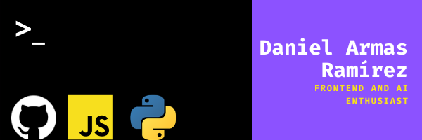

Hello there👋, my name is Daniel Armas and I'm a Frontend developer👨‍💻, I work with React and I'm learning Svelte. I'm interested in learning about AI and ML🤖.

* 📚I'm currently reading Introduction to AI.
* 💻I'm currently learning Julia programming language.
* 🤵Pronouns: he/him.

## I love JavaScript and Python
```javascript
const DanielArmas = {
  fullName: 'Daniel Armas Ramírez',
  age: 18,
  country: 'MX',
  programmingLanguages: ['JavaScript', 'Python', 'C++'],
  frontendTools: ['React', 'Svelte']
}
```

[](https://github.com/anuraghazra/github-readme-stats)
[
